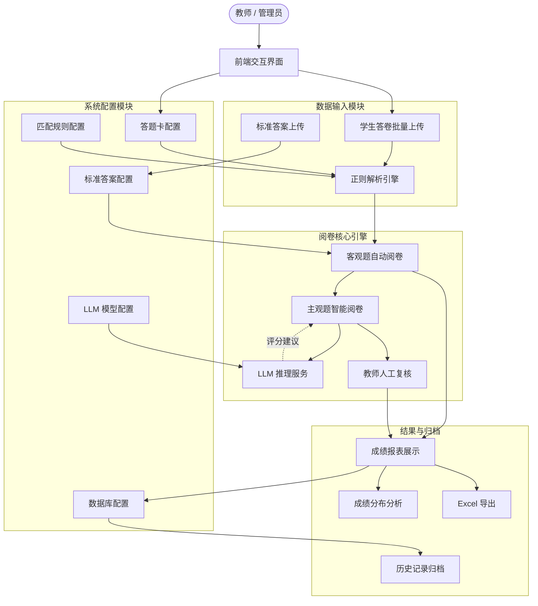

# 智能阅卷系统功能文档

## 1. 系统概述
智能阅卷系统 (Intelligent Exam Grading System) 是一款面向教师的桌面端辅助工具，旨在通过自动化和 AI 技术简化考试阅卷流程。系统支持从纯文本答题卡中提取数据，自动批改客观题，并利用大语言模型 (LLM) 辅助批改主观题，最终生成详细的成绩报表与分析。

## 2. 功能模块图

## 3. 详细功能说明

### 3.1 系统配置 (System Settings)
系统提供极其灵活的配置能力，以适应不同的考试需求。
*   **答题卡配置**：定义考试名称及试卷结构（分段）。支持自定义每一部分的题型（主观/客观）、分值、题量及识别关键字。
*   **标准答案配置**：
    *   **文件上传**：支持直接上传标准答案文本文件。
    *   **在线编辑**：自动解析上传的内容，并提供在线 JSON 编辑器，允许教师手动微调答案键值（如修正 OCR 错误）。
*   **LLM 配置**：集成了多种大模型供应商（DeepSeek, OpenAI, Moonshot, Gemini 等），支持自定义 Base URL、API Key 和模型参数（如 Temperature），赋能主观题智能批改。
*   **数据库配置**：配置 MySQL 数据库连接，实现考试数据的持久化存储与历史回溯。
*   **匹配规则配置**：高级正则配置，允许用户自定义用于提取“学号”、“姓名”、“题目”等信息的正则表达式，适配不同格式的答题卡。

### 3.2 学生答卷上传 (Student Upload)
*   **批量上传**：支持一次性拖拽上传数百个学生答题卡文件 (.txt)。
*   **智能解析**：系统根据配置的正则规则，自动从文件名或文件内容中提取学生身份信息及作答内容。
*   **状态预览**：实时显示解析成功率和学生列表，方便核对。

### 3.3 客观题阅卷 (Objective Grading)
*   **一键批改**：自动比对学生答案与标准答案。
*   **容错处理**：智能处理空格、大小写等常见格式差异。
*   **实时反馈**：阅卷完成后立即生成包含客观题得分的初步成绩单。

### 3.4 主观题阅卷 (Subjective Grading)
*   **AI 辅助**：对于简答题、应用题等主观题型，系统调用配置的 LLM 进行语义分析。
    *   **评分建议**：AI 根据题目描述和参考答案，给出建议得分。
    *   **评语生成**：AI 生成具体的扣分理由或改进建议。
*   **人机协作**：教师拥有最终决定权。界面展示学生作答、参考答案及 AI 建议，教师可一键采纳或手动修改分数与评语。

### 3.5 结果分析与归档 (Results & Analysis)
*   **成绩报表**：表格化展示所有学生的总分、各部分得分及详细作答情况。
*   **可视化图表**：自动生成成绩分布直方图，直观掌握班级整体水平。
*   **数据导出**：支持将完整成绩单导出为 Excel 文件。
*   **历史归档**：一键将当次考试的所有数据（包括配置、学生答卷、批改结果）保存至数据库，随时可在“历史记录”中查看或回滚。

## 4. 推荐工作流

1.  **初始化配置**：在`系统配置`页设置考试结构，并上传标准答案。
2.  **数据录入**：在`学生答卷上传`页批量导入学生答题卡文件。
3.  **客观题初筛**：进入`客观题阅卷`页，点击“开始客观题阅卷”完成基础评分。
4.  **主观题精批**：(如有主观题) 进入`主观题阅卷`页，利用 AI 辅助逐题或批量完成主观题评分。
5.  **结果发布**：在`批改结果`页查看最终报表，导出 Excel 或存档至数据库。
